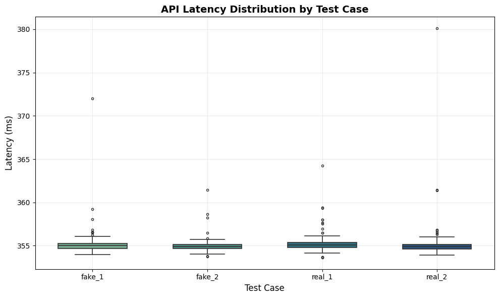

# E444-F2025-PRA5

https://colab.research.google.com/drive/1Udg-vIHmWSaF7oE-2CctxCoVzslzSYtT?usp=sharing

=== TABLE 1: Latency Summary (ms) ===
|    | test_case   |   average |   median |   minimum |   maximum |
|----|-------------|-----------|----------|-----------|-----------|
|  0 | fake_1      |    355.27 |   355    |    353.98 |    371.99 |
|  1 | fake_2      |    355.01 |   354.9  |    353.75 |    361.44 |
|  2 | real_1      |    355.34 |   355.1  |    353.63 |    364.24 |
|  3 | real_2      |    355.32 |   354.92 |    353.89 |    380.11 |

=== TABLE 2: Sample Performance Records ===
|    | test_case   |   request_id | timestamp           |   latency_ms |
|----|-------------|--------------|---------------------|--------------|
|  0 | fake_1      |            1 | 2025-11-13 20:43:35 |       355.71 |
|  1 | fake_1      |            2 | 2025-11-13 20:43:35 |       354.69 |
|  2 | fake_1      |            3 | 2025-11-13 20:43:35 |       354.82 |
|  3 | fake_1      |            4 | 2025-11-13 20:43:36 |       354.97 |
|  4 | fake_1      |            5 | 2025-11-13 20:43:36 |       354.95 |
|  5 | fake_1      |            6 | 2025-11-13 20:43:36 |       355.14 |
|  6 | fake_1      |            7 | 2025-11-13 20:43:37 |       355.29 |
|  7 | fake_1      |            8 | 2025-11-13 20:43:37 |       354.92 |
|  8 | fake_1      |            9 | 2025-11-13 20:43:37 |       354.91 |
|  9 | fake_1      |           10 | 2025-11-13 20:43:38 |       355.19 |

Overall Average Latency: 355.23 ms
